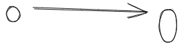

## Questions
- Why is associativity important? Maybe this is best illustrated with a counter example.
- Why is the commutivity of the identity element not trivial? Maybe another counter example.
- Continue and explain the rest of these example- how can references be passed? (that is, by value, by reference, by const reference, by move, and so **on**)
- Explain this quote more "Their surface area has to increase slower than their volume. (I like this analogy because of the intuition that the surface area of a geometric object grows with the square of its size — slower than the volume, which grows with the cube of its size.) The surface area is the information we need in order to compose chunks. The volume is the information we need in order to implement them. The idea is that, once a chunk is implemented, we can forget about the details of its implementation and concentrate on how it interacts with other chunks."

## Arrows as Functions

## Properties of Composition

## Composition is the Essence of Programming

## Challenges
The first three questions have been answered in Challenges.fs

1. Implement, as best as you can, the identity function in your fa-
   vorite language (or the second favorite, if your favorite language
   happens to be Haskell).
2. Implement the composition function in your favorite language.
   It takes two functions as arguments and returns a function that
   is their composition.
3. Write a program that tries to test that your composition function
   respects identity.
4. Is the world-wide web a category in any sense? Are links mor-
   phisms? 
5. Is Facebook a category, with people as objects and friendships as
   morphisms?
6. When is a directed graph a category?